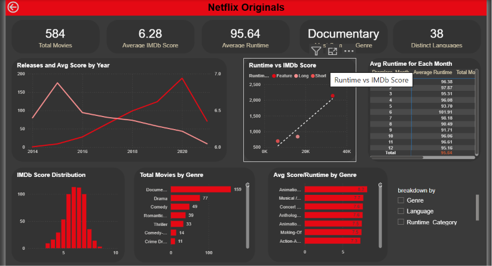

# Netflix Originals Dashboard — Power BI Project

A Power BI dashboard built as a hands-on learning project, analyzing a dataset of Netflix Original movies. The project walks through the full workflow — data cleaning, modeling, DAX measures, and visual design — to explore trends across genre, ratings, and runtime.

## 📊 Project Overview

This dashboard explores Netflix Originals data to answer questions such as:

What is the average runtime of movies released in different months?
What is the most common genre on Netflix?
Are movies in certain languages rated higher on average?
Which year had the highest average IMDB score?
What is the distribution of movies across different languages?
Are longer movies rated higher on IMDB?

## 🗂️ Dataset

Size: 584 rows × 9 columns
Description: Each row represents a Netflix Original movie, with fields covering title, genre, premiere date, runtime, IMDb score, and language.

## 🛠️ Tools Used

Power BI Desktop — data modeling, DAX, visualization
Power Query — data cleaning and transformation

## 🔄 Process

The project was built in phases:

Data Dictionary — documented each column's meaning and type
Power Query Cleaning — handled nulls (including missing premiere dates), fixed data types
Data Modeling — structured the data model for analysis
DAX Measures — built calculated measures for key metrics
Wireframe Layout — planned the dashboard layout before building visuals
Visual Construction — built out charts, cards, and filters
Dashboard Formatting — final polish on layout, colors, and styling

## 🖼️ Dashboard Preview

## ▶️ How to Use
Download .pbix file
Open with Power BI Desktop (recommended: latest version)

## 👤 Author

(Divya Nayak/ LinkedIn - https://www.linkedin.com/in/divya-nayak-b06496264/)
